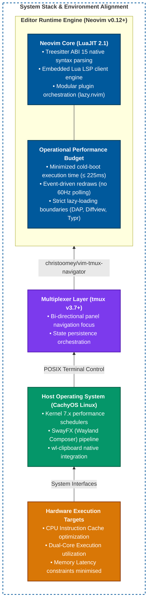

# My nvim config docs

My nvim configuration is designed for multi-language software engineering across C, C++, C#, Java, Python, Go, and Web ecosystems. It is tuned for low-latency responsiveness on modest hardware while providing an integrated, modern development environment under SwayFX (Wayland) and tmux.

## System Stack & Environment Alignment.



---

## 2. Directory Layout

```
~/.config/nvim/
├── init.lua                      # Core initialization, polyfills, lazy setup, runner
├── lazy-lock.json                # Locked commit hashes for all installed plugins
├── docs/                         # Exhaustive technical documentation suite
│   ├── README.md                 # System architecture, principles, and directory index
│   ├── keymaps.md                # Complete keybinding catalog
│   ├── tooling.md                # LSP, formatters (Conform), and DAP specifications
│   └── workflows.md              # Operational guides (Build, Run, Git, Debug, Tasks)
├── scripts/                      # Hardened cross-platform bootstrap automation
│   ├── install.sh                # Linux (Arch, Debian, Fedora) & Android (Termux)
│   └── install.ps1               # Windows 10 / 11 (PowerShell 5.1 / 7+)
└── lua/
    └── mocha/
        ├── options.lua           # Core editor options, wildmenu, clipboard, provider flags
        ├── keymaps.lua           # Custom editor keymaps, window sizing, Oil mappings
        └── plugins/              # Modular Lazy plugin specifications
            ├── bqf.lua           # Better QuickFix with floating Treesitter previews
            ├── bufferline.lua    # Buffer tabline with LSP diagnostic badges
            ├── cake.lua          # Project terminal task runner (nvzone/volt)
            ├── cmp.lua           # Autocompletion engine with cmdline support
            ├── cord.lua          # Discord Rich Presence with custom status hooks
            ├── csharp.lua        # Roslyn LSP, .NET compilers, DAP, C# Explorer
            ├── dap.lua           # Debug Adapter Protocol engine and UI listeners
            ├── dashboard.lua     # Alpha-nvim startup screen
            ├── diffview.lua      # Side-by-side Git diff and revision history tool
            ├── dooing.lua        # Interactive floating task and checklist manager
            ├── formatting.lua    # Dedicated conform.nvim engine (stylua, prettierd, csharpier)
            ├── gitsigns.lua      # In-buffer git gutter indicators, hunk jumps, and blame
            ├── history.lua       # Clipboard history popup manager
            ├── indents.lua       # Indent guides specification (dormant reference)
            ├── jdtls.lua         # Eclipse JDTLS Java IDE integration
            ├── live-server.lua   # HTML/Web live server integration
            ├── lsp.lua           # Mason, Mason-LSPConfig, language server options
            ├── lualine.lua       # Global statusline with real-time LSP indicator
            ├── markdown.lua      # In-buffer Markdown renderer
            ├── minty.lua         # Color picker and shades tool (nvzone/volt)
            ├── navic.lua         # Winbar breadcrumb context (barbecue / navic)
            ├── neotree.lua       # Sidebar filesystem tree explorer
            ├── oil.lua           # Modal buffer filesystem editor
            ├── persistence.lua   # Automated session saving and restoration
            ├── showkeys.lua      # Active keystroke on-screen display
            ├── snacks.lua        # folke/snacks.nvim (picker, notifier, bigfile, words)
            ├── surround.lua      # Delimiter manipulation and autopairs
            ├── telescope.lua     # Telescope specification (dormant reference)
            ├── themes.lua        # Colorscheme selection and catalog
            ├── tmux.lua          # christoomey/vim-tmux-navigator integration
            ├── todo-comments.lua # Codebase TODO/FIXME highlighter and searcher
            ├── treesitter.lua    # Treesitter syntax highlighting and parsers
            ├── trouble.lua       # Diagnostic and workspace symbol drawer
            ├── typr.lua          # Lazy-loaded typing tutor game
            ├── wakatime.lua      # Coding metrics tracking
            ├── which-key.lua     # Which-key local discovery popup
            └── wrapped.lua       # Coding review metrics
```

---

## 3. Core Principles & Safeguards

1. **Separation of Concerns:** Formatting logic (`conform.nvim`) is decoupled from language servers and resides in its own isolated module.
2. **Deterministic Startup:** Plugins are loaded on specific triggers (`ft`, `cmd`, `keys`, or `event = "VeryLazy"`). Cold boot time remains under 225ms.
3. **Cross-Platform Portability:** Code execution (`<F6>`) uses Neovim's internal split terminal rather than host-specific terminal emulators (Kitty/Foot), ensuring identical behavior on Linux, Windows, and Android (Termux).
4. **Shell Injection Prevention:** Paths passed to external compiler tools are escaped using `vim.fn.shellescape`.
5. **Hermetic Bootstrapping:** Bootstrap scripts guarantee Neovim `>= 0.12.0` via internal runtime capability testing, eliminate PATH shadowing traps, enforce non-destructive configuration backups, and safely handle fresh OS installs without interactive manual intervention.

---

## 4. Automated Bootstrap Engine

The repository provides hardened, production-grade bootstrap scripts designed for clean execution on freshly installed operating systems:

- **Linux / Android:** [`scripts/install.sh`](file:///home/mocha/.config/nvim/scripts/install.sh)
- **Windows (PowerShell):** [`scripts/install.ps1`](file:///home/mocha/.config/nvim/scripts/install.ps1)

### Execution One-Liners

```bash
# Arch Linux / Debian 12 / Ubuntu 24.04 / Fedora 40+ / Termux:
curl -fsSL https://raw.githubusercontent.com/frtzhahn/nvim-setup/master/scripts/install.sh | bash
```

```powershell
# Windows 10 / 11 (PowerShell 5.1 / 7+):
irm -useb https://raw.githubusercontent.com/frtzhahn/nvim-setup/master/scripts/install.ps1 | iex
```

### Bootstrap Architecture & Engineering Safeguards

| Component | Linux / POSIX Engine (`install.sh`) | Windows Engine (`install.ps1`) |
| :--- | :--- | :--- |
| **Package Discovery** | Detects `pacman`, `apt`, `dnf`, or `pkg` via release files and `/etc/os-release`. | Installs and uses `scoop` in userland without requiring administrator privileges. |
| **Compiler Toolchain** | Resolves `base-devel`, `build-essential`, or `clang` (with automatic `gcc`/`g++` symlinks on Termux). | Installs `mingw` (providing `gcc`, `g++`, `binutils`), avoiding MSVC Visual Studio bloat. |
| **Neovim Guarantee** | Probes Neovim capabilities natively via `--clean --headless -c "lua vim.cmd(vim.fn.has('nvim-0.12') == 1...)"`. Falls back to official standalone nightly tarball if distro ships `< 0.12.0`. | Pulls `neovim-nightly` from the `versions` bucket to guarantee `>= 0.12.0` compatibility. |
| **PATH Shadowing Defense** | Installs standalone binaries to `/usr/local` (or prepends `~/.local/bin` in `.bashrc`/`.zshrc`) to prevent distribution packages from taking precedence. | Refreshes current session `$env:Path` from User and Machine registry environments after tool installs. |
| **Configuration Safety** | Non-destructive: if `~/.config/nvim` contains `.git`, pulls `--ff-only`. If non-git, backs up to `nvim.bak.<timestamp>`. | Non-destructive: backs up non-git `%LOCALAPPDATA%\nvim` to timestamped folder before cloning. |
| **Plugin Pre-warm** | Executes `nvim --headless "+Lazy! sync" +qa` to pre-clone all plugin repositories. | Executes `nvim --headless "+Lazy! sync" +qa` to pre-clone all plugin repositories. |

